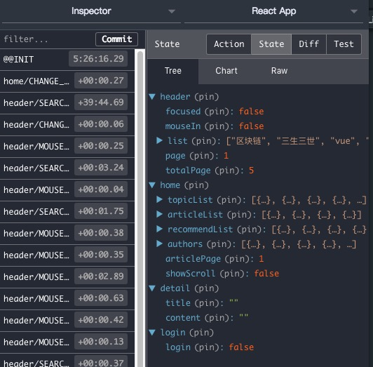

# React project


### `library`

* Redux：
* Redux-thunk：
* Immutable：
* Loadable：
* Transition-group：
* styled-components：
* axios：

**data structure：**



### `file structure`
```
┣━ build   // 打包文件
┣━ public   // 打包文件
  ┣━ api   //假数据统一存储
    ┣━ detail.json   //文章页数据
    ┣━ headerList.json   //头部热门搜索数据
    ┣━ home.json   //首页统一数据
    ┣━ homeList.json   //首页加载更多文章数据
    ┣━ login.json   //登录数据
┣━ src //开发目录
  ┣━ common   //公用组件
    ┣━ header   //头部组件
      ┣━ store   //Redux文件
        ┣━ actionCreators.js   //action创建
        ┣━ constants.js   //action.type常量文件
        ┣━ index.js   //入口文件
        ┣━ reducer.js   //reducer处理
      ┣━ store   //UI组件
      ┣━ store   //头部样式
  ┣━ pages   //页面
    ┣━ detail   //文章页
      ┣━ ...
    ┣━ detail   //首页
      ┣━ ...
    ┣━ detail   //登录页
      ┣━ ...
    ┣━ detail   //写文章
      ┣━ ...
  ┣━ statics   //静态文件
    ┣━ ...
  ┣━ store   //Redux数据
    ┣━ ...
  ┣━ App.js   //入口及路由
  ┣━ index.js   //js文件入口
  ┣━ style.js   //全局样式
┣━ .gitignore   //git忽略上传文件
┣━ package.json   //模块的描述文件
┣━ README.md   //说明文件
┣━ yarn.lock   //模块的描述文件
```

### `result`


